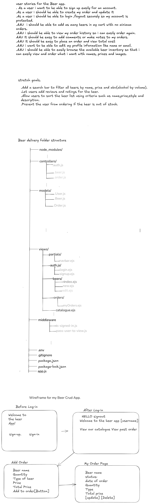

PROJECT TITLE.
. Beer Crud App

SUMMARY OF THE PROJECT
A full stack web ordering app where users can sign up, browse beers, create new ones , edit their order, update it and also delete anything they dont want. built using node.js, Express, MongoDB, and EJS.

FEATURES

User authentication(log-in, sign-up, and sign-out)
Browse beer catalogue
Add beers to the catalogue by Admin or user creates an order 
Place a new order
View past orders
Edit and delete orders

Technologies used.

Node.js
Express
MongoDB and Mongoose
EJS
Bulma for styling
method-override
express-session
Bcrypt
Morgan
dotenv
Vs code

Getting started
clone the repo. git clone 
Setting up the enviroment variables
Install dependencies npm install
create a .env file and add 
MONGODB_URI=
SECRET_SESSION=
create a .gitignore file

Run the app using nodemon server.js

Open in the browser using http://localhost:3000

USAGE
Visit the welcome page. sign-in if you already have an account or sign-up
View our catalogue once you sign-in or view your past orders
Place an order by selecting beer(s) and quantity.
View all orders and either edit or delete them.
signout when done.

USER STORIES

.As a user i want to be able to sign up easily for an account.
.As a user i should be able to create my order and update it
.As a user i should be able to login /logout securely so my account is
protected.
.AAU i should be able to add as many beers in my cart with no minimum 
orders.
.AAU i should be able to view my order history so i can easily order again.
AAU it should be easy to add comments or make notes to my orders.
.AAU it should be easy to place an order and view total cost
.AAU i want to be able to edit my profile information like name or email.
.AAU i should be able to easily browse the available beer inventory so that i
can easily view and order what i want with names, prices and images.

STRETCH GOALS

.Add beer reviews and ratings.
.Search/filter catalogue by price, name or type.
.Prevent the user from ordering if the Beer is out of stock.

PLANNING AND DESIGN

i used Excali draw for my user stories, folder structure and wireframe.(https://excalidraw.com/#json=tJ5zb8MxoTB5UCNEEOdb_,oSDMvS_cVMXWhErMWWFWRg)! 

Entity Relationship Diagram i used Lucid charts
ERD https://lucid.app/lucidchart/893ab7d1-4fbe-4e9c-8859-84e15ba6e6c4/edit?viewport_loc=89%2C-26%2C1503%2C911%2C0_0&invitationId=inv_fb0be8a9-a216-4ff6-8c3a-510a695049c3 .png>)
